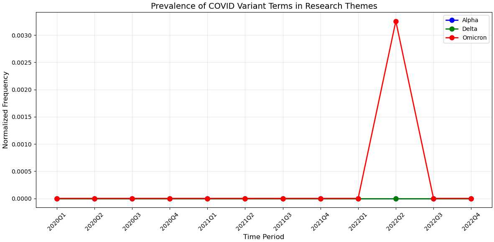
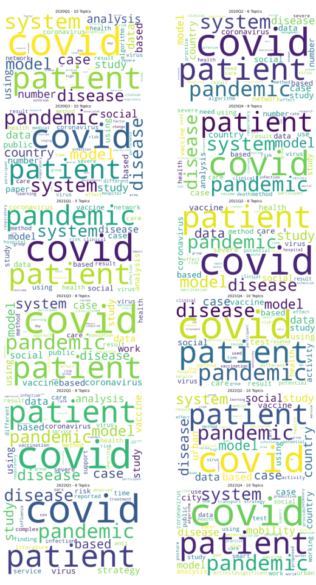

# COVID-19 Research Trends Analysis

.png)

A temporal analysis of COVID-19 research themes using LDA topic modeling and NLP, tracking how scientific focus shifted throughout the pandemic from 2020 to 2022.

## Overview

This project analyzes 50,000+ academic articles from the [CORD-19 dataset](https://www.kaggle.com/datasets/allen-institute-for-ai/CORD-19-research-challenge/data?select=metadata.csv) to uncover how COVID-19 research topics evolved over time. Articles were grouped by quarter and analyzed using topic modeling techniques to identify shifting research priorities in response to real-world events like vaccine rollouts, new variants, and changing public health policies.

## Key Findings

- Vaccine-related research spiked around 2021Q4, aligning with public vaccination campaigns and Omicron emergence
- Mental health research grew steadily as the pandemic progressed
- Long-term COVID effects were surprisingly underrepresented throughout the entire period
- Early 2020 research focused heavily on understanding the virus itself, shifting toward treatment and intervention by 2021

## Tech Stack

- **Python**
- **Pandas** — data cleaning and manipulation
- **NLTK** — text preprocessing
- **Gensim** — LDA topic modeling
- **Scikit-learn** — TF-IDF vectorization, MiniBatchKMeans clustering
- **SciBERT** — transformer-based semantic embeddings
- **UMAP** — dimensionality reduction
- **KeyBERT** — automatic topic labeling
- **Matplotlib / Seaborn** — visualizations
- **WordCloud** — word cloud generation

## Methodology

1. **Data Preprocessing** — cleaned and normalized 50,000+ article titles and abstracts using NLTK (lowercasing, tokenization, stopword removal, lemmatization)
2. **Temporal Segmentation** — grouped articles by publication quarter (2020Q1 through 2022Q4)
3. **TF-IDF Vectorization** — converted text to numerical matrix, filtering rare and overly common terms
4. **Topic Number Optimization** — tested 2–10 topics per quarter, selecting optimal count via coherence scores
5. **LDA Topic Modeling** — trained using online learning on the full TF-IDF matrix with 8 topics
6. **Semantic Embeddings** — used SciBERT + UMAP to reduce high-dimensional embeddings to 10 dimensions
7. **Clustering** — applied MiniBatchKMeans with KeyBERT labeling for interpretable topic names
8. **Stratified Sampling** — final iteration sampled 5% per quarter proportionally for unbiased representation

## Visualizations

### Evolution of Research Topics Over Time
.png)

### Topic Prevalence Over Time
.png)

### Topic Distribution Over Time
.png)

### Prevalence of COVID Variant Terms

### Evolution of COVID-19 Research Themes
.png)

### Word Cloud

### Research Theme Evolution (Stratified Sampling)
_Stratified_Sampling.png)

### Research Theme Evolution (Max 500 Papers Per Quarter)
_Max_500_Papers_Per_Quarter.png)

### Research Theme Evolution (500 Papers Per Quarter)
_500_Papers_Per_Quarter.png)

## Dataset

[CORD-19 Research Challenge — Kaggle](https://www.kaggle.com/datasets/allen-institute-for-ai/CORD-19-research-challenge/data?select=metadata.csv)

> Note: The dataset is not included in this repository due to its size. Download `metadata.csv` from the link above and place it in the root directory before running the notebooks.

## Contributors

Built by Devesh Singarh, with contributions from Amy Freij Camacho, Wang Qianyi, Raheem Kanji, Sylvester Mekwuye, and Michael Lin.
